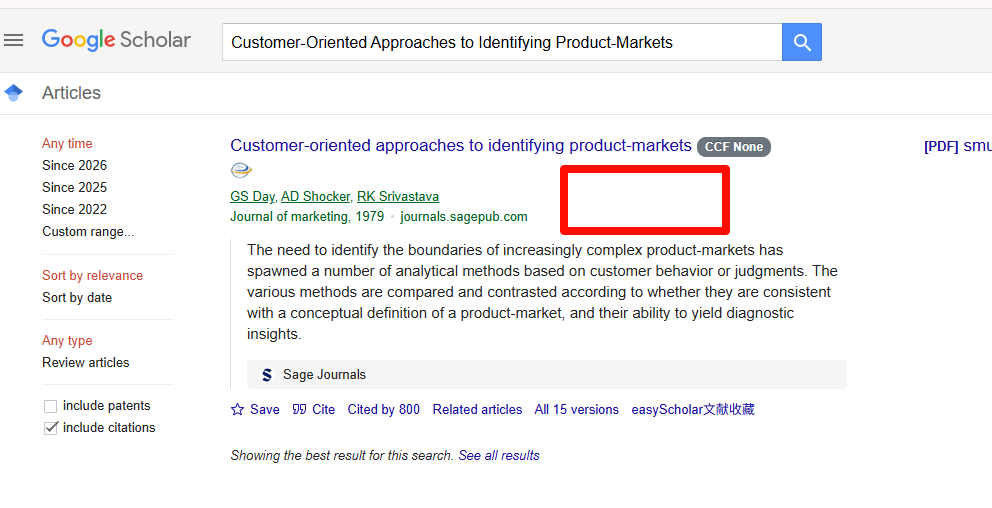
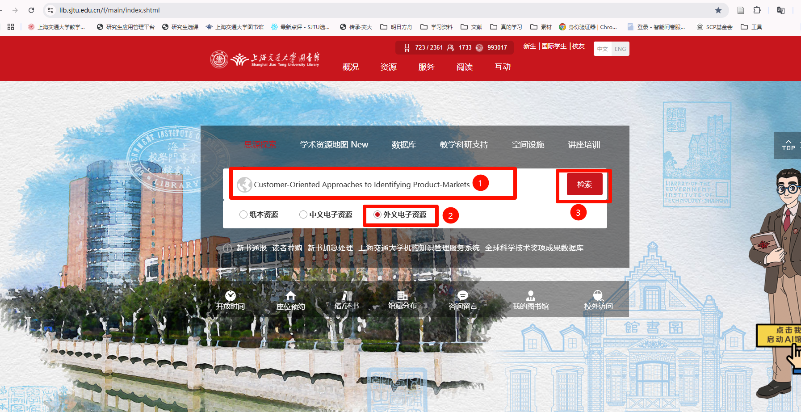
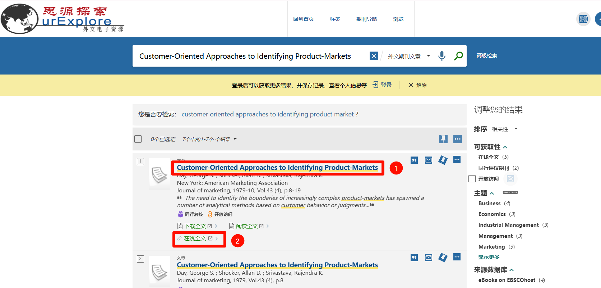
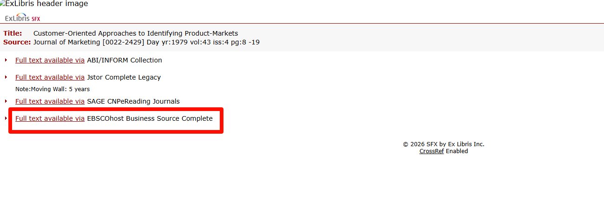
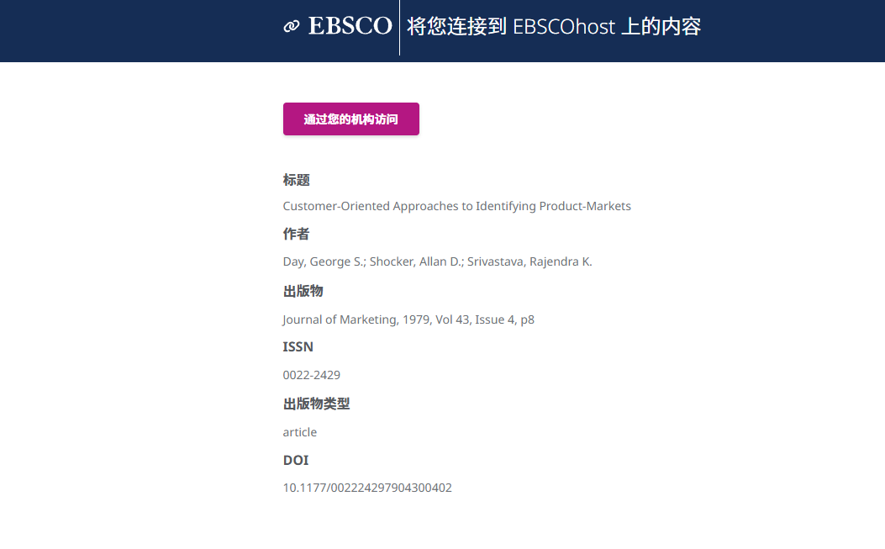
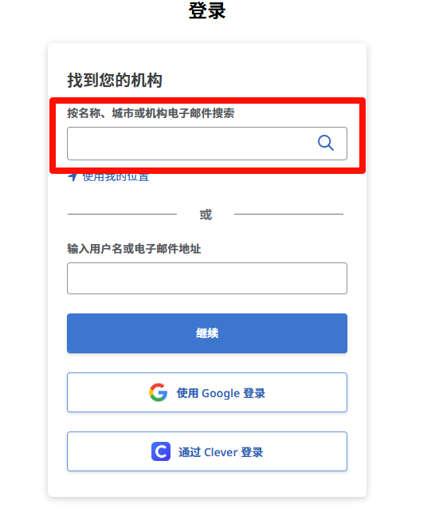
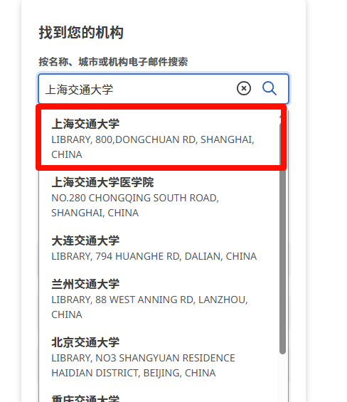
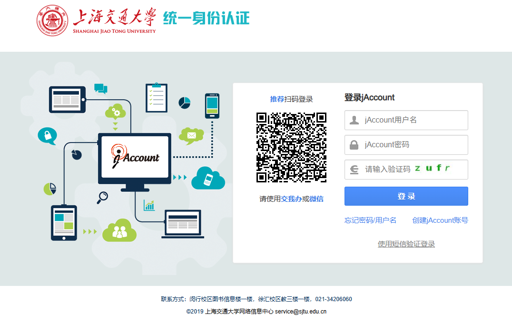
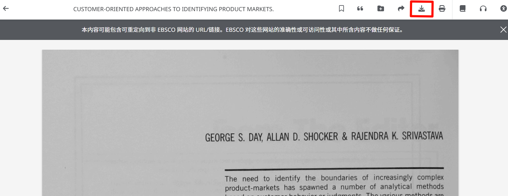
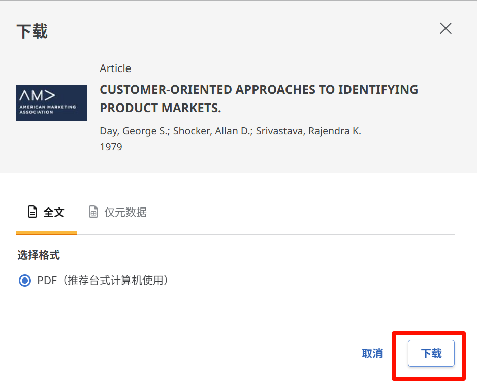

# 任务
你的任务是写一个Chrome插件，在GoogleScholar的文献搜索界面中加载一个按钮，此按钮能自动导航到交通大学在线图书馆下载对应文献pdf

## 按钮设定

在https://scholar.google.com/界面，当进入对给定关键词的搜索，如：https://scholar.google.com/scholar?hl=en&as_sdt=0%2C5&q=Customer-Oriented+Approaches+to+Identifying+Product-Markets&btnG=

界面如图

在红框出来的位置设置一个按钮。点击按钮后触发下述行为

## 按钮触发后操作

### 提取GoogleScholar对应搜索结果的文献标题

### 进入上海交通大学图书馆网页，准备搜索

网址为https://www.lib.sjtu.edu.cn/f/main/index.shtml

进入后如图，需要：
1. 在搜索框中输入文献标题
2. 切换到【外文电子资源】，点击前面的圆圈
3. 点击【搜索】按钮

### 在搜索结果页面中进一步点击

点击搜索后会跳转网址，比如跳转到：https://86sjt-primo.hosted.exlibrisgroup.com.cn/primo-explore/search?query=any,contains,Customer-Oriented%20Approaches%20to%20Identifying%20Product-Markets&tab=paper_tab&search_scope=paper_foreign&vid=fer&offset=0

搜索结果页面如图：

1. 先检查搜索结果是否正确。我们默认第一个就是目标文献。如果没有任何结果，或者第一个结果的标题不是目标问下按标题，提示报错，然后结束。
2. 正确后点击【在线全文】按钮，进入下一个页面

### 在在线全文页面中进一步点击

点击后会跳转网址，比如跳转到：https://sfx-86sjtu.hosted.exlibrisgroup.com.cn/86sjtu?ctx_ver=Z39.88-2004&ctx_enc=info:ofi/enc:UTF-8&ctx_tim=2026-05-11T13%3A24%3A17IST&url_ver=Z39.88-2004&url_ctx_fmt=infofi/fmt:kev:mtx:ctx&rfr_id=info:sid/primo.exlibrisgroup.com:primo3-Article-jstor_proqu&rft_val_fmt=info:ofi/fmt:kev:mtx:journal&rft.genre=article&rft.atitle=Customer-Oriented%20Approaches%20to%20Identifying%20Product-Markets&rft.jtitle=Journal%20of%20marketing&rft.au=Day,%20George%20S.&rft.date=1979-10-01&rft.volume=43&rft.issue=4&rft.spage=8&rft.epage=19&rft.pages=8-19&rft.issn=0022-2429&rft.eissn=1547-7185&rft.coden=JMKTAK&rft_id=info:doi/10.1177/002224297904300402&svc_val_fmt=info:ofi/fmt:kev:mtx:sch_svc&svc.fulltext=yes&rft_dat=%3Cjstor_proqu%3E1250266%3C/jstor_proqu%3E%3Cgrp_id%3Ecdi_FETCH-LOGICAL-c288t-4b6f3e8f77a73d1ef7a134d77b8d3ac3e556595da5f843170a72e56322ed4f393%3C/grp_id%3E%3Coa%3E%3C/oa%3E%3Curl%3E%3C/url%3E&rft_id=info:oai/&rft_pqid=1296618100&rft_id=info:pmid/&rft_jstor_id=1250266&isCDI=true

搜索结果如图：
1. 查找可选网址中是否有【EBSCOhost】开头的Source。不同文献的可用来源的数量、顺序、名称都可能不同。只使用【EBSCOhost】来源。如果没有也提示报错结束。
2. 点击前面的【Full text available via】超链接，进一步跳转

### EBSCOhost验证（Optional）

这一步可能触发，也可能由于已经验证过所以不被出发
1. 如图。点击【通过您的机构访问】
2. 如图。在【按名称、城市或机构电子邮件搜索】下输入【上海交通大学】
3. 如图.在搜索结果中，再次点击下拉列表中的【上海交通大学】
4. 如图。在Jaccount登录中，依次输入Jaccount用户名，Jaccount密码，验证码。
前两者在.env中，key分别为Jaccount_Username和Jaccount_PWD.验证码只有简单的英文字母或数字，需要用一个简单的CNN视觉模型识别后填入（基于CPU）

成功登陆Jaccount后，会自动连续跳转若干页面，耐心等待。

### 下载pdf
最终会跳转到如https://research.ebsco.com/c/btxihk/viewer/pdf/sonsog63jz?route=details的网址，页面如图

1. 点击红框下载按钮
2. 。继续点击【下载】

## 插件要求

1. 有两个设置，一个是上述所有过程不占据我现有chrome页面，新开一个页面执行，且默认在后台默认headless。但可以设置为后台有头，以方便调试